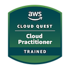

# AWS Cloud Quest: Cloud Practitioner 🌩️

Successfully completed AWS Cloud Quest: Cloud Practitioner, earning the official badge and certificate.
Built foundational knowledge of cloud computing concepts and AWS services, including:

- Cloud infrastructure and architecture
- Security and compliance fundamentals
- Storage and database services
- Networking and content delivery
- Deployment and monitoring practices

Tools & Services Used: Amazon EC2, Amazon S3, AWS IAM, Amazon VPC, and Amazon CloudWatch.

